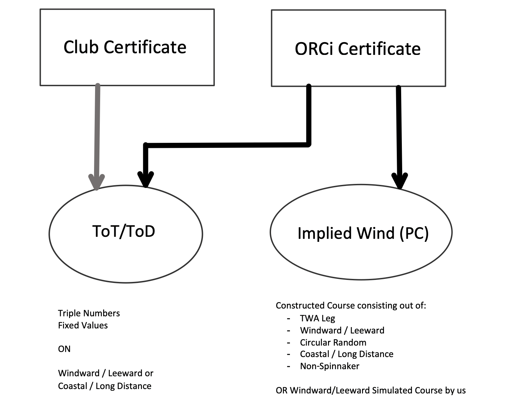

# ORC Development Roadmap
This document is for orientation of the open ToDos and possible compliactions on the development/implementation of the ORC Handicap Scoring in the SAP Sailing Analytics.

The scoring itself allows to choose between using the simpler provided ToT/ToD scoring on different values (Triple Numbers or combined values on Windward/Leeward or Coastal/Long Distance) or creating a so called performance curve for scoring. The performance curve itself can be built flexible to a predefined course (Windward/Leeward, Circular Random, Coastal/LongDistance, Non-Spinnaker), with fixed legs and their TWAs or from a combination of the first two options.

---
## Calculation Module

Currently the calculation for a constructed course with set TWAs does work with matching values to the official ORC tools and M2S. The internal calculations follow the ideas provided in the ORC pascal code, many calculating parts are using the predicted velocity value instead of the allowance.
The calculation involves the following implemented parts:

- get Allowances for Leg with TWA
- get Lagrange interpolated Allowance for TWA/TWS
- get Allowances for whole Course out of leg parts
- create Performance Curve on set of Allowances
- get ImpliedWind for a given Duration on the Performance Curve
- get Duration for a given ImpliedWind on the Performance Curve

### Mixed Course
The next step is to extend the properties of an ORCPerformanceCurveLeg to not only be defined as a leg with a specified TWA and an fixed allowance calculated with Lagrange but also be defined as a leg as a predefined course.

- [ ] Add enums for predefined courses
- [ ] Add or change ORCPerformanceCurveLeg implementation (and interface)
- [ ] Adapt ORCPerformanceCurveImpl to handle Legs with predefined allowances
- [ ] Get Allowances from the Importer to the Certificate
- [ ] Add Test Cases for this course

---
## Adapter
After the functionality for the different course possibilities is added, there needs to be a system which takes on the difficulty between automatically deciding/proposing the course information from the tracked legs and giving the race officer the opportunity to overwrite the proposed information with his own evaluation.
This problem should be resolved by the usage of the RaceLog and by the usage of an adapter pattern to match the information given from a TrackedRace to the ORCPerformanceCurveCourse.

For this purpose there are the following subtasks:

- [ ] UML for this concept
- [x] create RaceLogEvent for TWA/Length information per Leg. This task additionally consists out of some design decisions regarding the revokability of events.
- [x] create RaceLogEventAnalyzer for this Event *currently focussed on these tasks*
- [ ] implement logic to get TWA/Length from a TrackedLeg
- [ ] implement logic wether to use information from RaceLog or automatic generated from TrackedLeg
- [ ] implement Listener on RaceLog
- [ ] implement Listener on Adapter, so the Ranking Metric get's the signal to recalculate

Future:
The next challenge will be to use the RegattaLog (and maybe also RaceLog) to define the used RankingMetric for a Race. It's not common but there are some races which mix the used RankingMetrics during a regatta. It can be Windward/Leeward with TripleNumbers on some inshore races and constructed course on a coastal.

Scratchbook:
- TrackedRace
- RaceLog
- RaceLogEvent -> non revokable

---
## Certificate Management
We want to provide the possibility to change the ORCCertificate per Race (even if this is a corner case and the racing rules don't allow such flexibility). The currently (in this race) used certificates are managed by the ORCPerformanceCurveRankingMetric. The matching of competitor/boat to a certificate will happen via the admin console and
currently it will be set provisionally for the whole regatta. The RankingMetric will load this matching and eventual
updates from racelog upon creation (a RankingMetric is created per TrackedRace). Of course, there should be an opportunity to update the matching, as long as the RankingMetric lives.
From this point the Ranking Metric can choose to create PerformanceCurves to new Courses when it decides that it's
necessary.

- [ ] UML for this concept
- [ ] RegattaLogEvent to Match Competitor to available Certificate (transport the Certificate Object directly)
- [ ] RegattaLog Analyzer
- [ ] RaceLog for Update? Or a RegattaLogEvent as an update, if a certificate change for a competitor
- [ ] APIs for RankingMetric
- [ ] Saving the Certificates in the MongoDB in case of restart (-> Serialization)

Scratchbook:
- MGMT, DB, PC, TripleN, ToT
- CompetitorAndBoatStore
- BoatStore
- RMS Importer
- Long Series (Mittwochsregatta, change of Certificate/Rating Number) new Certificate/Race??
- Serializing/Deserializing, saving certificates to the MongoDB

---
## Ranking Metric
So the main responsibility of the RankingMetric is the calculation of the current ranking based on the tracking information. From this ranking the next step is to calculate the time deltas based on the scratch boat.
For us the easiest way is to use the boat farthest ahead as the scratch boat. For now we will only support this scratch
boat, on the long run we need to support the automatic decision of the scratch boat based on the GPH or a manual
decision of the user.

- [ ] Certificate Management
- [ ] Calculation Parts **[tbd]** 

Scratchbook:
- Differences in corrected time do apply on the boat farthest ahead
- Possibility needed to select scratch boat afterwards, so comparison of corrected times with other tools under the same conditions can be provided

---
## UI Adaptions
Scratchbook:
- Possibility to set RaceLogs (Leg Information) from Admin Console
- Possibility to choose Scratch Boat from Admin Console
- Possibility to match Boat (Competitor with Boat) to an unique Certificate
- Leaderboard should change in regards of the ranking metric (Implied Wind automatically shown on performance curve scoring but not shown during one design races)

---